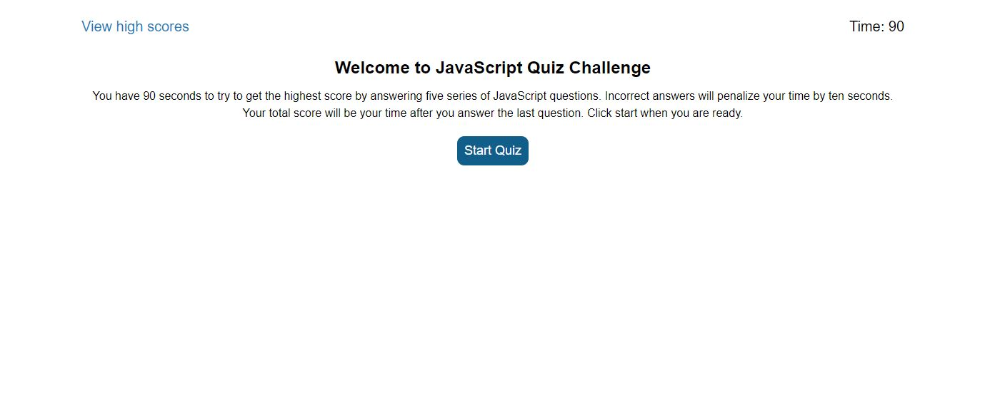
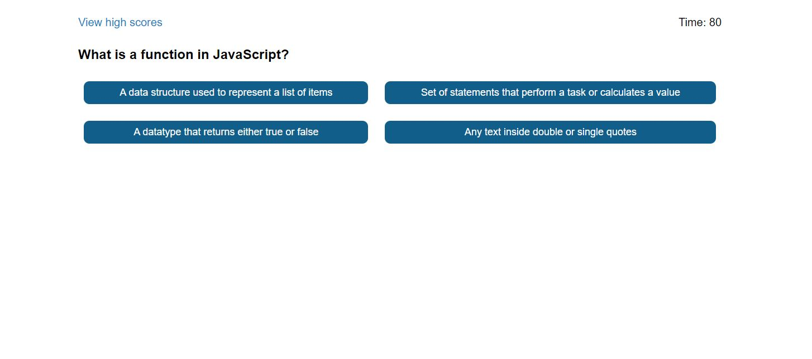
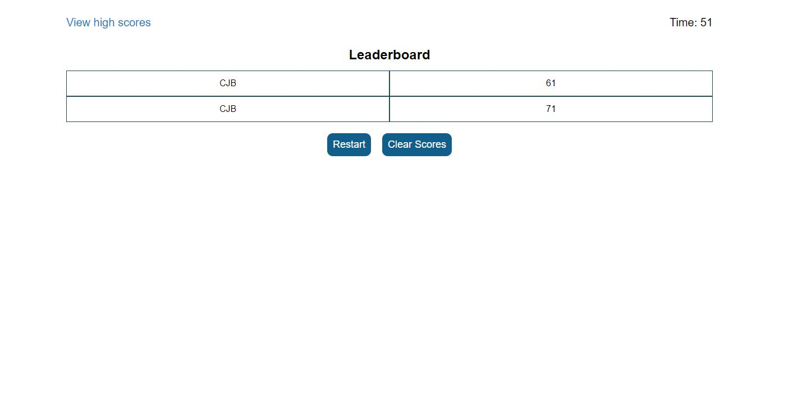

# WEB API QUIZ

## 1. Description
A timed multiple-choice quiz on JavaScript fundamentals that stores the users high scores in localStorage.

[DIRECT LINK](https://cbushehry.github.io/web-api-quiz/)

## 2. Features
 * User has 90 seconds to complete the quiz
 * User is presented with 5 multiple-choice questions when the start button is pressed
 * If the user select the wrong answer, time is subtracted from the clock
 * Save your initals to leaderboard when quiz is complete
 * Users high scores are saved in localStorage
 * User can clear the leaderboard at any point

## 3. Credits / Contact
This website was created by Cameron Bushehry

Contact me: c.bushehry@gmail.com